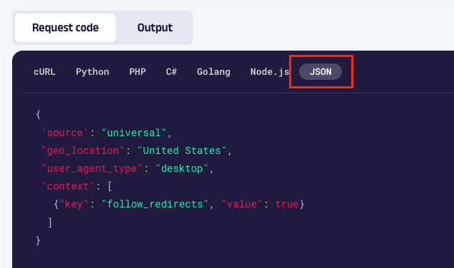
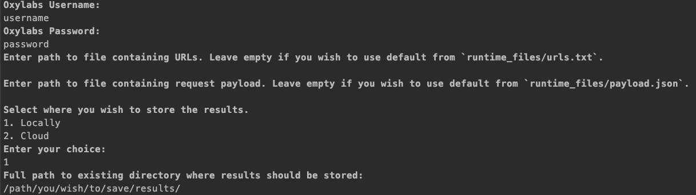
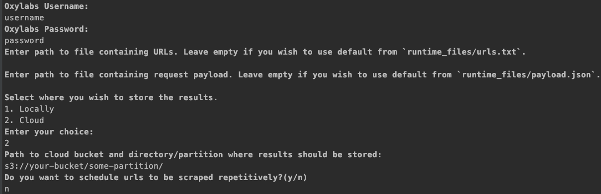
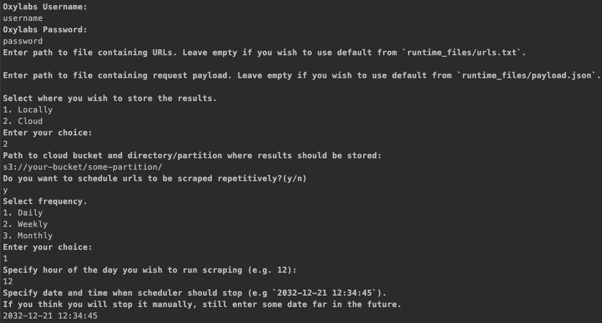
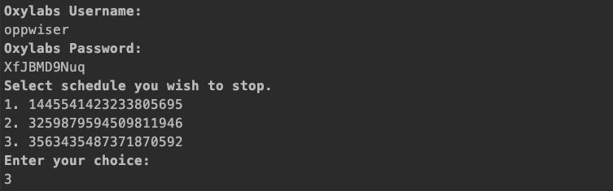

# playground-setup

## Requirements

* Python 3.9+

## Setting up Python Environment

1. Open a terminal or command prompt;
2. Clone this repository:
   ```
   git clone git@gitlab-ssh.int.oxyplatform.io:oxybrain/scraper-api-setup.git
   ```
3. Navigate to your project directory:
   ```
   cd scraper-api-setup/
   ```
4. Create a virtual environment using Python 3.9:
   ```
   python3.9 -m venv venv
   ```
5. Activate the virtual environment:
   - On Mac/Linux:
     ```
     source venv/bin/activate
     ```
   - On Windows:
     ```
     venv\Scripts\activate
     ```

## Installing Requirements

1. Ensure your virtual environment is activated
2. Install the required packages:
   ```
   pip install -r requirements.txt
   ```

## Setting up Scraper API

The only thing you need to set it up is to prepare a list of URLs and payload of Scraper API parameters which can be generated in our playground. Below you will find general steps to run our Scraper API and a few examples of different options you have to run it.

Steps:
1. Generate payload by describing your scraping needs in Oxy playground (https://dashboard.oxylabs.io/en/api-playground).
2. Copy payload and store it either in `runtime_files/payload.json` or as a new file on your device.

3. Store URLs you wish to scrape in `runtime_files/urls.txt` or as a new file on your device. Each url must be separated by newline.
4. Run script which registers/performs your scraping jobs (ensure you have completed installation steps stated above and have environment activated).
    ```
    python3.9 run.py
    ```
5. This will start a setup wizard, where you have to provide information about your account and some other.
6. Enter your Oxylabs username and password. It will be cached into file `.env`. If you later wish to change it, just remove this file.

### Examples
#### Store completed jobs locally

1. Initiate `run.py` script.
   ```
   python3.9 run.py
   ```
2. When asked `Select where you wish to store the results.` enter `1` to choose `Locally`.
3. When asked `Full path to existing directory where results should be stored:` enter path to directory where completed jobs should be stored. This directory must already exist on your device.
4. That's it, completed jobs will be stored in desired location after some time, depending on the number of URLs you asked to scrape.

*Image of wizard for reference*



#### Store completed jobs in cloud

We do support only AWS S3 or Google Cloud Storage for now.
1. Initiate `run.py` script.
   ```
   python3.9 run.py
   ```
2. When asked `Select where you wish to store the results.` enter `2` to choose `Cloud`.
3. When asked `Path to cloud bucket and directory/partition where results should be stored:` enter path to your cloud directory where completed jobs should be stored. Bucket permissions should be adjust by using these instructions - https://developers.oxylabs.io/scraper-apis/serp-scraper-api/features/cloud-storage.
4. When asked `Do you want to schedule urls to be scraped repetitively?(y/n)` enter `n` as now we just want to scrape all URLs once.

*Image of wizard for reference*



#### Store completed jobs in cloud and schedule it to be repeated.
1. Initiate `run.py` script.
   ```
   python3.9 run.py
   ```
2. When asked `Select where you wish to store the results.` enter `2` to choose `Cloud`.
3. When asked `Path to cloud bucket and directory/partition where results should be stored:` enter path to your cloud directory where completed jobs should be stored. Bucket permissions should be adjust by using these instructions - https://developers.oxylabs.io/scraper-apis/serp-scraper-api/features/cloud-storage.
4. When asked `Do you want to schedule urls to be scraped repetitively?(y/n)` enter `y`.
5. Next you have to select frequency. 
   * If you choose `Daily`, you will need to enter hour scraping jobs will run each day.
   * If you choose `Weekly`, you will need to select weekday scraping jobs will run each week.
   * If you choose `Monthly`, you will need to enter day scraping jobs will run each month.
6. Lastly, you will be asked to specify date and time when scheduler should stop. You MUST enter end time in format of `2032-12-21 12:34:45`. You will be able to stop scheduler before end time. Example of how to do it is in next section.
7. You will get schedule id, which you should save.

*Image of wizard for reference*



## Stopping scheduler
1. Initiate `run.py` script.
   ```
   python3.9 stop.py
   ```
2. Enter your username and password.
3. Select schedule id you wish to deactivate.

*Image of wizard for reference*

